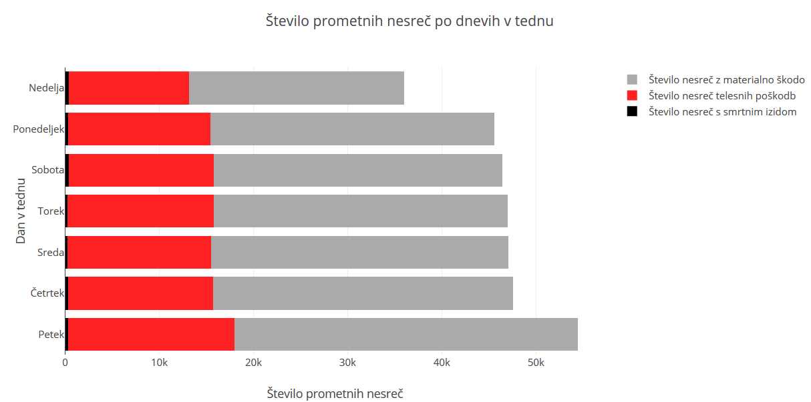
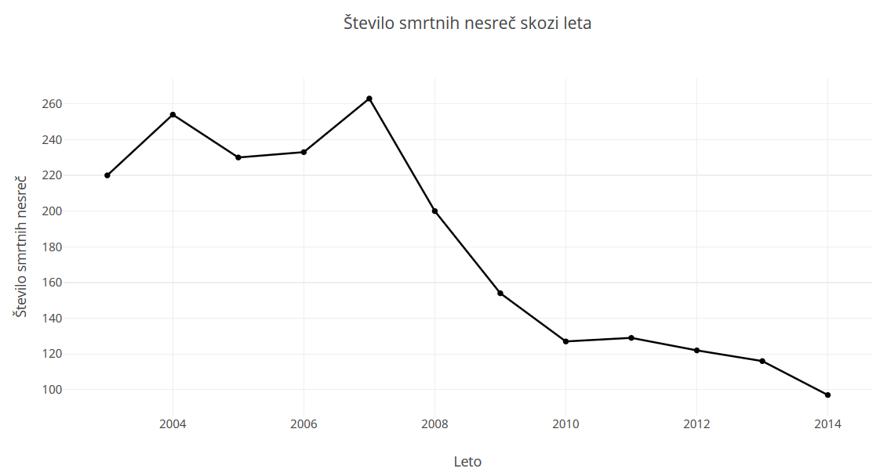
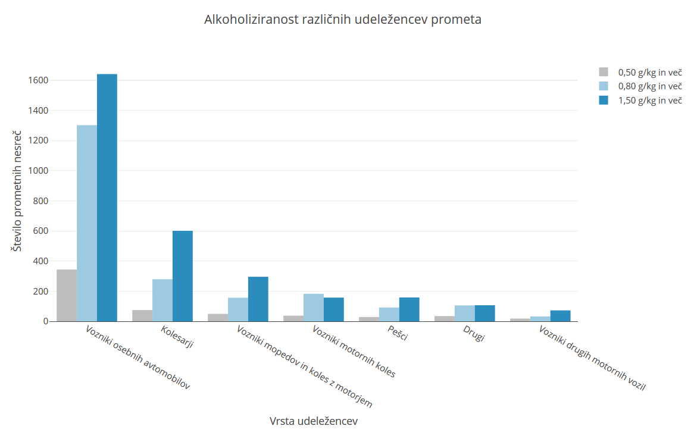
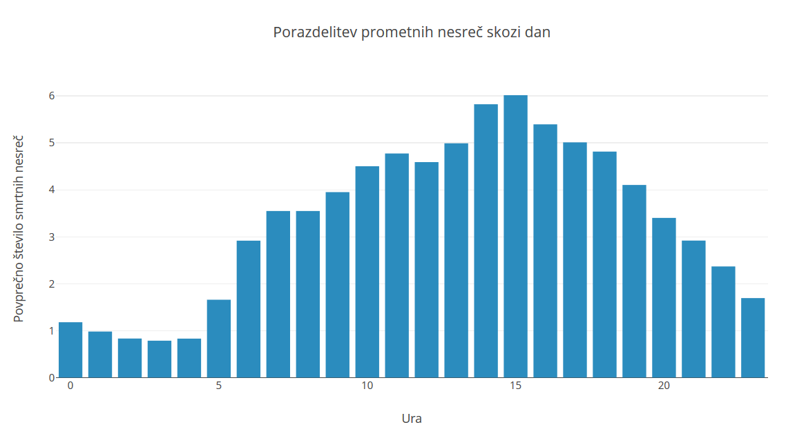

# Analiza prometnih nesreč v Sloveniji

## Člani skupine

| Ime in priimek | Vpisna številka |
| -------------- | --------------- |
| Nejc Stopar | 63160290 |
| Miloš Kostadinovski | 63160172 |
| Miha Debenjak | 63160407 |

## Podatki

Podatke za projektno nalogo smo našli na spletnem portalu [podatki.gov.si](https://podatki.gov.si/data/search?s=Udele%C5%BEenci%20v%20cestnoprometnih%20nesre%C4%8Dah) na temo prometnih nesreč v Sloveniji do leta 2014. 

## Cilji
- Vpliv alkoholiziranosti v prometnih nesrečah
- Povezava med časovnimi obdobji in številom nesreč
- Analiza poškodb in smrtnih nesreč
- Določitev najbolj in najmanj varnih okoliščin za vožnjo

## Opis podatkovne zbirke
Atributi se nahajajo v različnih ".csv" datotekah in so razvrščeni:
- `alkohol.csv`: Udeleženci v prometnih nesrečah - pod vplivom alkohola, Slovenija, letni podatki do 2014
- `po_dnevih.csv`: Cestnoprometne nesreče in udeleženci v nesrečah po dnevu nesreče v tednu, Slovenija, letni podatki do 2014
- `po_mesecih.csv`: Cestnoprometne nesreče in udeleženci v nesrečah po mesecu nesreče v letu, Slovenija, letni podatki do 2014
- `po_urah.csv`: Cestnoprometne nesreče in udeleženci v nesrečah po urah dneva, Slovenija, letni podatki do 2014 
- `po_vrsti_ceste.csv`: Cestnoprometne nesreče in udeleženci v nesrečah po vrsti ceste, Slovenija, letni podatki do 2014
- `po_lokaciji.csv`: Cestnoprometne nesreče in udeleženci v nesrečah po lokaciji, Slovenija, letni podatki do 2014 
- `po_vrstah_udeležencev.csv`: Udeleženci v cestnoprometnih nesrečah po vrstah udeležencev, Slovenija, letni podatki do 2014
- `po_regijah.csv`: Cestnoprometne nesreče in udeleženci v nesrečah, statistične regije, Slovenija, letni podatki do 2014 

## Obravnavanje manjkajočih podatkov
Na začetku smo manjkajoče podatke, ki smo jih zasledili, zamenjali s povprečnimi vrednostmi atributa. 
```python 
alkohol["Stopnje alkoholiziranosti 0,80 in več"].fillna(alkohol.groupby("Kategorija")["Stopnje alkoholiziranosti 0,80 in več"].transform("mean"), inplace=True)
alkohol["Stopnje alkoholiziranosti 0,80 in več"] = alkohol["Stopnje alkoholiziranosti 0,80 in več"].astype(int)
```

Potem smo se lotili iskanja zanimivih podatkov in njihove vizualizacije. Izračunali smo število vrst nesreč po dnevih:



Na podoben način smo pridobili še podatke o številu prometnih nesreč skozi leta, alkoholiziranisti voznikov vpletenih v prometne nesreče, porazdelitvi prometnih nesreč po urah.



Iz grafa je lepo razvidno, da po letu 2007 število nesreč s smrtnim izidom drastično pade. 



Presenetil nas je podatek, da so na drugem mestu na grafu alkoholiziranosti kolesarji.



Največ prometnih nesreč se po pričakovanjih zgodi ob 15h, saj je takrat na cestah tudi največ prometa.
